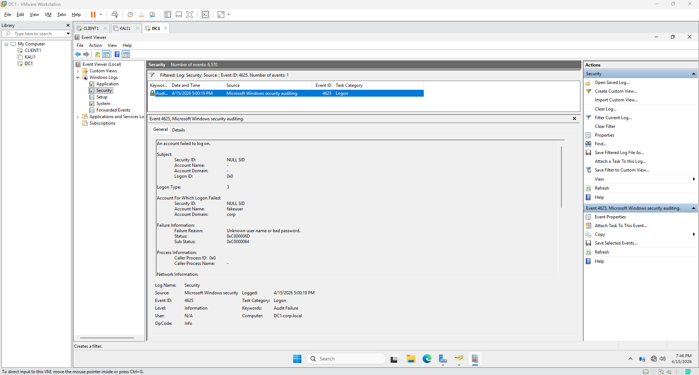
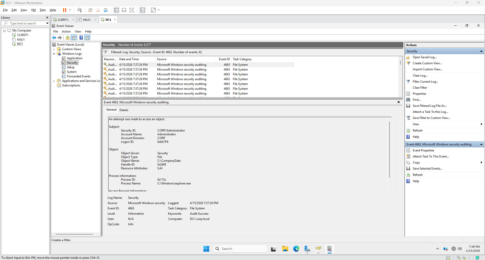
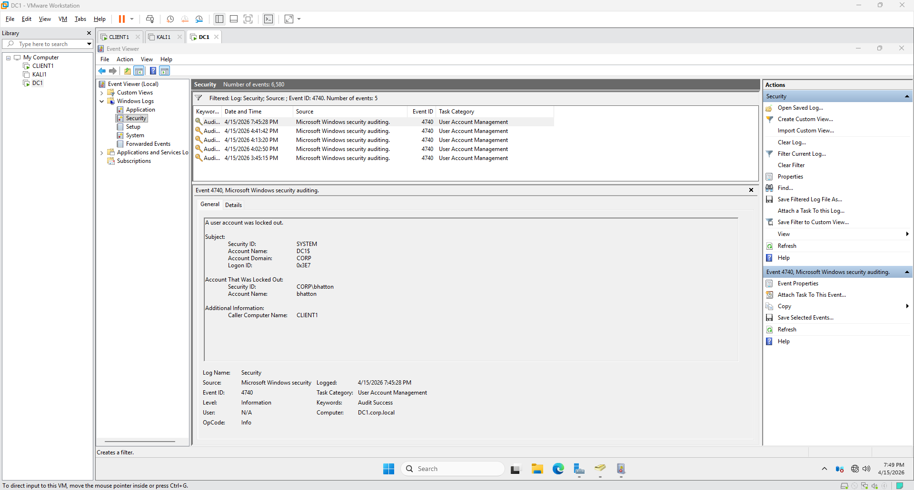
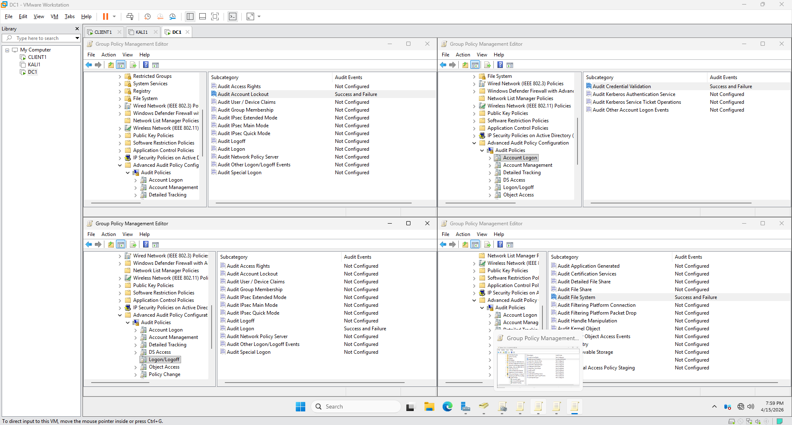
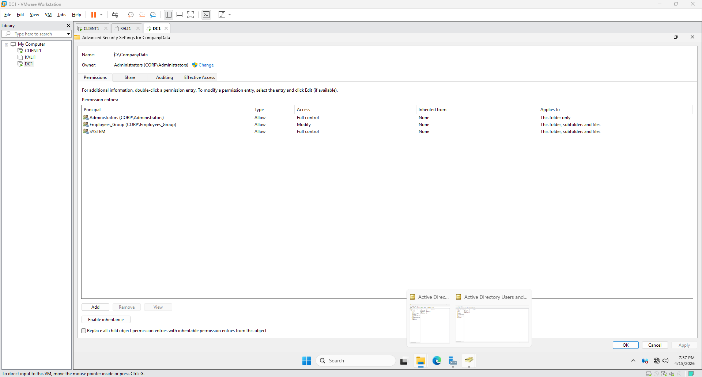

# Homelab Project 1: Active Directory Security Lab

## Overview
Built and secured an Active Directory lab environment to develop hands-on experience in identity and access management, system hardening, and security monitoring. Configured user accounts and Group Policy Objects, enforced least privilege access controls, and analyzed Windows Security Event Logs to monitor authentication activity and identify potential security threats.

## Enironment
- Windows Server (Domain Controller)
- Windows Client (Domain-Joined Workstation)
- Kali Linux (Attack Simulation System)
- Active Directory Domain: corp.local

## Key Components
- DC1 (Domain Controller)
- CLIENT1 (Domain-Joined Workstation)
- KALI1 (Attacker Security Testing Machince)
- Organization Units: Employees, IT, Workstations

## Security Implementation
### Identity and Access Management
- Created users, groups and organizational units
- Implemented role-based access control using security groups (e.g., Employees_Group)
- Enforced least privilege for all users and resource access 

### Group Policy Hardening
- Configured password policies
- Enforced account lockout threshholds to mitigate bruteforce, dictionary, and hybrid attacks.
- Applied user restrictions using Group Policy Management

### File System Security
- Secure sensitive directories and ensured the oppropriate users had access (e.g., HR-Confidential)
- Removed inherited permissions and applied explicit New Technology File System access controls
- Implemented group-based permissions to simplify access management

## Monitoring and Detection
### Advanced Audit Policies Configured
- Logon and logoff auditing
- Credential validation monitoring
- Account lockout tracking
- Object access auditing

### Key Security Events Analyzed
- 4624 - Successful logon
- 4625 - Failed logon attempt
- 4740 - Account lockout
- 4663 - File access activity

## Attack Simulation
To validate the configured security controls, the following scenarios were performed:
- Simulated repeated failed login attempts to trigger account lockout policies
- Attempted unauthorized access to restricted directories to verify access control enforcement
- Generated file activity (create, modify, delete) to validate object access auditing

Following these events:
- Reviewed security logs in Event Viewer to analyze activity
- Verified suspicious activity with the user
- Unlocked the affected account and required a password reset at next login
- Demonstrated basic incident response and account recovery procedures

Results:
- Security controls functioned as expected
- Unauthorized access attempts were successfully denied
- Suspicious activity was logged in Windows Security Event Logs
- Administrative recovery actions were completed successfully

## Validation and Testing
Screenshots are included in the  directory to show how everything was set up and tested throughout the lab. These cover:

### Failed Logon Event (4625)
Multiple failed login attempts were generated and logged.

### File Access Auditing (4663)
File system auditing was configured and validated.

### Account Lockout (4740)
Account lockout triggered after repeated failed attempts.

### Group Policy Configuration
Audit policies configured via GPO.

### File Permissions
NTFS permissions enforcing least privilege.

## Key Takeaways
- Set up a structured Active Directory environment with basic access control configurations
- Applied least privilege principles to help protect sensitive resources
- Configured audit policies to enable security monitoring and logging
- Tested detection capabilities through simple attack simulations
- Performed basic incident response tasks, including reviewing, unlocking user accounts, and reseting passwords
- Gained hands-on experience analyzing Windows Security Event Logs

## Skills Demonstrated
- Active Directory Administration  
- Identity and Access Management  
- Group Policy Configuration  
- Windows Security Event Monitoring
- File System Auditing and Monitoring 
- Access Control and Least Privilege  
- Security Monitoring and Basic Incident Response 

## Project Status
Completed - Active Directory environment implemented, security controls enforced, and functionality validated through simulated activity and event log analysis.
